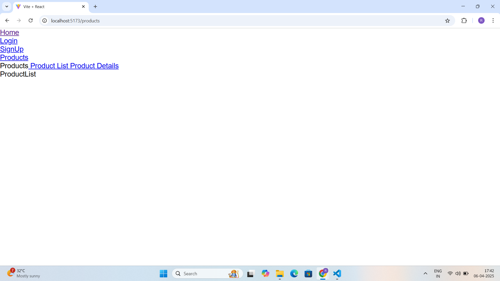
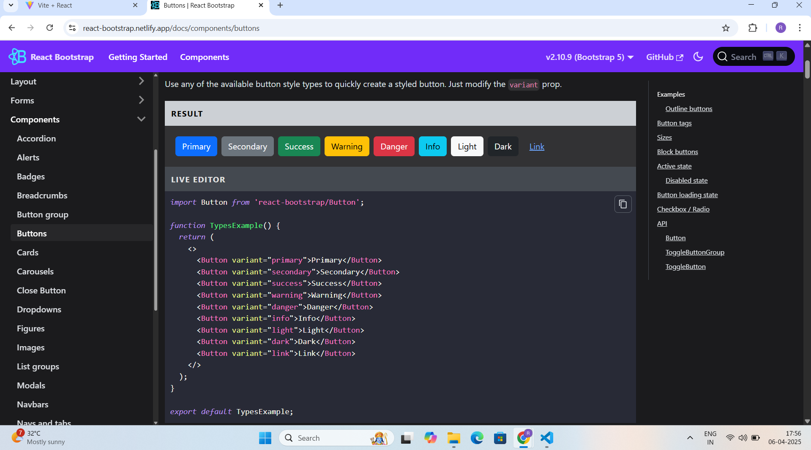
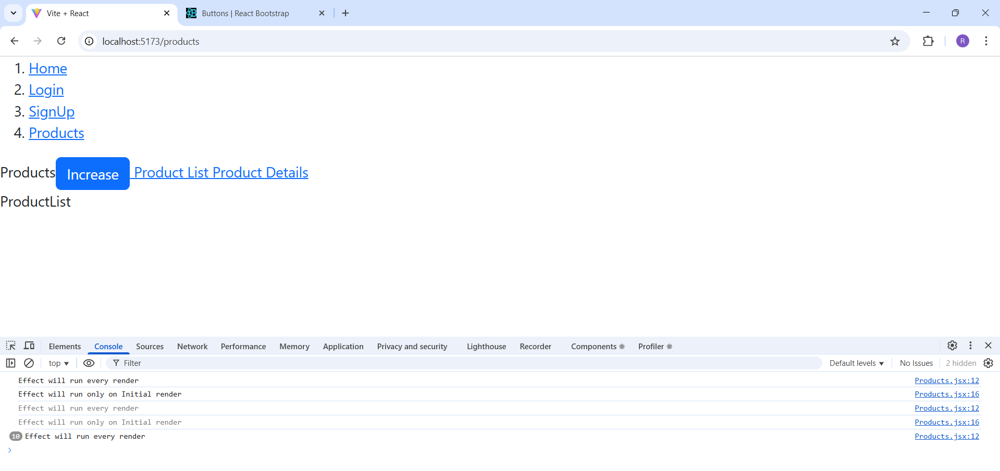
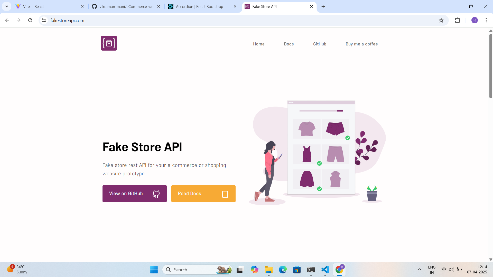
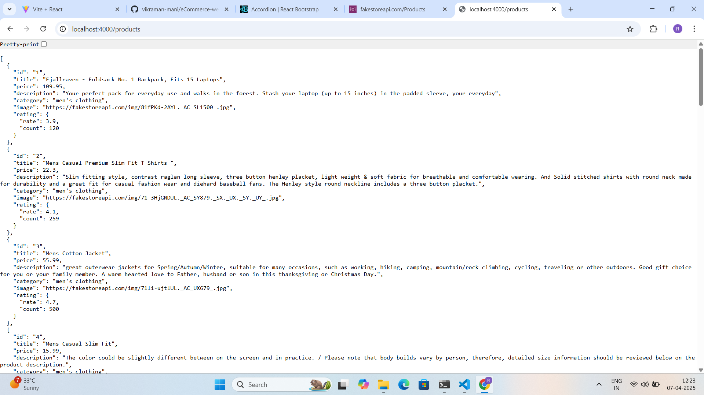

# React + Vite

This template provides a minimal setup to get React working in Vite with HMR and some ESLint rules.

Currently, two official plugins are available:

- [@vitejs/plugin-react](https://github.com/vitejs/vite-plugin-react/blob/main/packages/plugin-react/README.md) uses [Babel](https://babeljs.io/) for Fast Refresh
- [@vitejs/plugin-react-swc](https://github.com/vitejs/vite-plugin-react-swc) uses [SWC](https://swc.rs/) for Fast Refresh

## Expanding the ESLint configuration

If you are developing a production application, we recommend using TypeScript and enable type-aware lint rules. Check out the [TS template](https://github.com/vitejs/vite/tree/main/packages/create-vite/template-react-ts) to integrate TypeScript and [`typescript-eslint`](https://typescript-eslint.io) in your project.

1.  npm i react-router-dom

useNavigate() hook help to navigate button like login button
Link method use to Nav-bar

React-Bootstrap:- npm install react-bootstrap bootstrap
https://react-bootstrap.netlify.app/docs/getting-started/introduction

useEffect() hook (component side effect) ==> CallBack Function & Dependency

useEffect( ()=>{} , [] )

JSON Server --> Own DataBase db.json --> Start a server to host the date --> Endpoint - Rest API

npm i json-server

npm i json-server -g (globally)

https://fakestoreapi.com/Products

Create db.json file and add value as { "product": (paste data) }

Start a Server to host data (open terminal with end point eCommerce\eCommerce-website\e-commerece_app\src\data> )
json-server --watch db.json --port 4000

Endpoints:
http://localhost:4000/products

API call with Fetch (Another libraries are Axios api)
